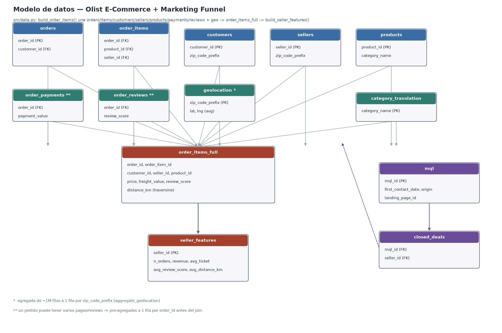

# Olist — Inteligencia estratégica y optimización logística de marketplace

> **Análisis integral del dataset de Olist (marketplace brasileño, +100.000 pedidos) para optimizar la conversión de leads a sellers, segmentar vendedores por Lifetime Value y cuantificar el impacto de la geografía en la logística.**


---

## Problema de negocio

Olist es el marketplace más grande de Brasil. Como cualquier marketplace, su negocio depende de tres palancas: (1) traer sellers y convertirlos en cuentas activas, (2) que esos sellers vendan mucho y con buena reputación, (3) que la logística no destruya la experiencia del cliente. Este proyecto ataca las tres.

**Preguntas concretas que responde:**

1. **Lead scoring** — De cada 100 leads que llegan al equipo comercial, ¿cuáles vale la pena perseguir porque van a facturar mucho?
2. **Segmentación de sellers** — En vez de tratar a los +3.000 sellers como un bloque, ¿en qué grupos naturales se dividen? ¿Qué recomendación aplica a cada grupo?
3. **Impacto de la geografía en la logística** — ¿Cuánto se encarece el flete y cuánto baja el review score por cada 100 km entre vendedor y comprador? ¿Dónde conviene abrir un nuevo depósito?

---

## Dataset

[Olist Brazilian E-Commerce Public Dataset](https://www.kaggle.com/datasets/olistbr/brazilian-ecommerce) — 9 tablas relacionales, 100k pedidos, 3k sellers, 96k customers únicos, período 2016-2018. Se complementa con el [Marketing Funnel Dataset](https://www.kaggle.com/datasets/olistbr/marketing-funnel-olist) que aporta MQLs y closed deals para el análisis de conversión.



---

## Metodología

| Fase | Técnica | Entregable |
|------|---------|------------|
| ETL | Consolidación de 9 tablas relacionales, limpieza, traducción de categorías PT→ES | Dataset unificado en `data/processed/` |
| EDA | Estadística descriptiva, distribuciones, correlaciones, ECDF | `notebooks/01_eda.ipynb` |
| Feature engineering geoespacial | Distancias Haversine entre zip codes seller-customer | Feature `distance_km` |
| **Modelo 1 — Lead Scoring** | **XGBoost** clasificando MQL → seller de alto valor | `notebooks/02_lead_scoring.ipynb` + `models/xgb_lead_scoring.pkl` |
| **Modelo 2 — Segmentación** | **PCA + K-Means** sobre features de comportamiento de sellers | `notebooks/03_seller_segmentation.ipynb` |
| Interpretabilidad | SHAP values sobre XGBoost | `reports/figures/shap_*.png` |
| Dashboard | Streamlit deployado en cloud | Link público (próximamente) |

---

## Resultados clave

> _Sección en construcción. Se completa a medida que avanzan los notebooks 02 y 03._

- [x] AUC del modelo de lead scoring: **0.719** (test; target = conversión de MQL a seller)
- [x] Número óptimo de clusters de sellers: **K=4** — en riesgo (11%, review 1.93), pequeños y confiables (39%), power sellers (30%), nicho premium (19%)
- [x] Coeficiente de correlación distancia ↔ flete: Pearson 0.39, Spearman 0.63
- [ ] Coeficiente de correlación distancia ↔ review score
- [x] Top features según SHAP (lead scoring): `contact_month` > `lp_freq` > `origin` > `contact_dayofweek`

---

## Estructura del repositorio

```
analisis-olist/
├── data/                  # CSVs crudos (ignorados por git, se bajan con el script)
├── notebooks/             # Jupyter notebooks narrados
│   └── 01_eda.ipynb
├── src/                   # Código Python reutilizable
│   ├── __init__.py
│   └── download_data.py
├── reports/
│   └── figures/           # PNGs para el README y para presentaciones
├── models/                # Modelos entrenados serializados (.pkl)
├── requirements.txt
├── .gitignore
└── README.md
```

---

## Setup

**Requisitos:** Python 3.10+, cuenta de Kaggle (gratis).

**1. Clonar el repo:**

```bash
git clone https://gitlab.com/LeandroLocurcio/analisis-olist.git
cd analisis-olist
```

**2. Crear entorno virtual e instalar dependencias:**

```bash
python -m venv .venv
source .venv/bin/activate       # Linux/Mac
# .venv\Scripts\activate        # Windows
pip install -r requirements.txt
```

**3. Configurar credenciales de Kaggle:**

- Entrá a [kaggle.com](https://www.kaggle.com) → tu perfil → **Account** → **Create New API Token**.
- Descargás un archivo `kaggle.json`.
- Movelo a `~/.kaggle/kaggle.json` y protegé permisos: `chmod 600 ~/.kaggle/kaggle.json`.

**4. Descargar los datos:**

```bash
python src/download_data.py
```

**5. Abrir los notebooks:**

```bash
jupyter lab
```

---

## Stack técnico

- **Lenguaje:** Python 3.10+
- **Manipulación de datos:** pandas, numpy
- **Visualización:** matplotlib, seaborn, plotly
- **Geoespacial:** geopandas, shapely, pyproj
- **Machine Learning:** scikit-learn, XGBoost, SHAP
- **Dashboard:** Streamlit (fase final)
- **Cloud:** Google BigQuery (fase final, para queries analíticas contra warehouse)
- **Versionado:** git + GitLab

---

## Roadmap

- [x] EDA exhaustivo del dataset (distribuciones, geografía, logística, reviews)
- [x] Estructura del repositorio y setup reproducible
- [x] ETL consolidado con funciones reutilizables en `src/data.py`
- [x] Feature engineering geoespacial (distancias haversine)
- [x] Modelo XGBoost de lead scoring + SHAP
- [x] Segmentación de sellers con PCA + K-Means
- [ ] Migración de queries clave a BigQuery
- [ ] Dashboard Streamlit deployado en cloud
- [ ] Dockerfile para reproducibilidad total (opcional)

---

## Autor

**Leandro Locurcio**
📧 locurcioleandronahuel@gmail.com
🔗 [GitLab](https://gitlab.com/LeandroLocurcio)

Proyecto en desarrollo activo. Feedback y sugerencias bienvenidos.
